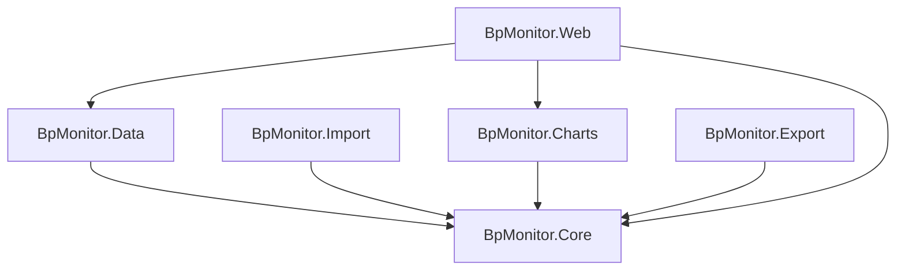

# Architecture: Blood Pressure Monitor

## Solution Structure

```text
code/
├── BpMonitor.slnx
├── BpMonitor.Core           # Domain models, interfaces, business logic
├── BpMonitor.Core.Tests     # Unit tests for Core
├── BpMonitor.Data           # EF Core + SQLite, repository implementations
├── BpMonitor.Data.Tests     # Integration tests for Data
├── BpMonitor.Import         # Markdown and JSON importers
├── BpMonitor.Import.Tests   # Unit tests for Import
├── BpMonitor.Charts         # Plotly.NET chart generation
├── BpMonitor.Charts.Tests   # Snapshot tests for Charts
├── BpMonitor.Export         # JSON serialisation and file write
├── BpMonitor.Export.Tests   # Tests for Export
├── BpMonitor.Web            # Falco web app (dashboard, add, history pages)
├── BpMonitor.Web.Tests      # Tests for Web layer
└── BpMonitor.Arch.Tests     # ArchUnit tests enforcing Clean Architecture rules
```

## Tech Stack

| Concern | Decision |
| --- | --- |
| Solution format | `.slnx` (new XML-based format, VS 2022 17.10+) |
| Language / Runtime | F# on .NET |
| Web Framework | Falco 5 + Falco.Markup (server-rendered F# HTML) |
| Web interactivity | htmx (vendored, no build step) |
| Logging | Serilog.AspNetCore — structured CLEF JSON to stdout; `UseSerilogRequestLogging` for per-request lines; configured via `appsettings.json` `Serilog` section; captured by `docker logs` / `podman logs` / journald |
| Database | SQLite + EF Core |
| Charting | Plotly.NET — generates interactive HTML, opens in default browser |
| Validation | `FsToolkit.ErrorHandling` — applicative validation with `Validation<'ok, 'err>` |
| Architecture | Clean Architecture (Core has zero dependencies on other projects) |
| Architecture tests | ArchUnit (via `BpMonitor.Arch.Tests`) |

## Data Model

```fsharp
// BpMonitor.Core
type BloodPressureReadingUnvalidated = {
    Systolic:  int
    Diastolic: int
    HeartRate: int
    Timestamp: DateTimeOffset
    Comments:  string option
}

type BloodPressureReading = {
    Id:         int
    Systolic:   int
    Diastolic:  int
    HeartRate:  int
    Timestamp:  DateTimeOffset
    Comments:   string option
    CreatedAt:  DateTimeOffset
    ModifiedAt: DateTimeOffset
}

type ValidationError =
    | SystolicOutOfRange  of int
    | DiastolicOutOfRange of int
    | HeartRateOutOfRange of int
```

## Dependency Diagram



## Project Responsibilities

### BpMonitor.Core

- Domain models (`BloodPressureReading`, `BloodPressureReadingUnvalidated`)
- Repository interface (`IReadingRepository`)
- Business logic: applicative validation via `FsToolkit.ErrorHandling`
- No dependencies on other projects

### BpMonitor.Data

- EF Core `DbContext` and `ReadingRecord` entity
- SQLite configuration (`appsettings.json`)
- `IReadingRepository` implementations: `EfReadingRepository`, `InMemoryReadingRepository`
- Manual schema migrations via `SchemaMigrations` module (EF Core migrations do not support F#)
- `ReadingRepositoryFactory` wiring

### BpMonitor.Import

- Parses blood pressure readings from Markdown files (`parseMarkdown`, `parseLine`)
- Upsert import logic with summary (`ImportSummary`: added, updated, failed counts)
- Imports `BloodPressureReading` lists from JSON (`JsonImport.parse`, `JsonImport.tryReadFromFile`, `JsonImport.import`)
- Depends on Core only

### BpMonitor.Charts

- Plotly.NET chart generation (`BpChart.toHtml`)
- Produces a self-contained interactive HTML file opened in the default browser
- Depends on Core only

### BpMonitor.Export

- JSON serialisation of `BloodPressureReading` lists (`serialize`, `tryWriteToFile`)
- Depends on Core only

### BpMonitor.Web

- Falco web application serving on `0.0.0.0:5000`
- Three pages: `/` landing hub, `/add` entry form, `/history` table + chart iframe
- Server-rendered HTML via `Falco.Markup`; htmx for partial updates
- Scoped `DbContext` per request (concurrency-safe)
- Structured logging via Serilog: one CLEF JSON line per request + domain events; logs flow to stdout → container/journal
- References Core + Data + Charts

### BpMonitor.Arch.Tests

- ArchUnit rules enforcing Clean Architecture layer boundaries
- Core must not depend on Data, Web
- Data must not depend on Web
- Import must not depend on Data, Charts, Export, Web
- Charts must not depend on Data, Web
- Export must not depend on Data, Charts, Import, Web

## Design Principles

- Core is dependency-free to allow easy testing and future frontend swaps
- Each project has a single clear responsibility
- Best practices and longevity over shortcuts

## Development Tooling

[mise](https://mise.jdx.dev/) manages language runtimes and standalone tools for this project. The `mise.toml` at the repo root pins all tool versions; run `mise install` once after cloning to set up the local environment.

| Tool | Version source | Purpose |
| --- | --- | --- |
| Biome | `mise.toml` | JS linter (`biome check`) for files in `wwwroot/` |

**Local usage:**

```bash
mise install          # install all pinned tools
mise exec -- biome check          # lint JS files
mise exec -- biome check --write  # auto-fix safe issues
```

**CI:** the `lint-js` job in `.github/workflows/ci.yml` runs `biome check` via the `biomejs/setup-biome` action with the same pinned version.

## Architecture Decision Records

See [docs/adr/](adr/) for records of significant architectural decisions, including abandoned spikes.
