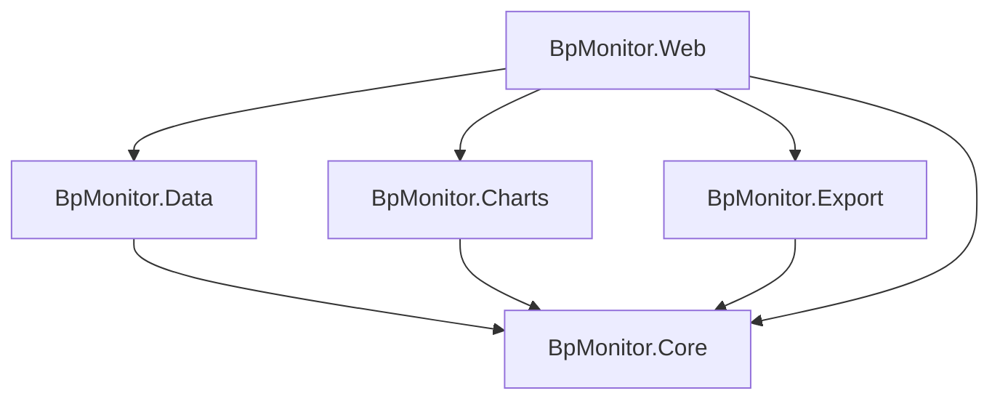

# Architecture: Blood Pressure Monitor

## Solution Structure

```text
code/
├── BpMonitor.slnx
├── BpMonitor.Core           # Domain models, interfaces, business logic
├── BpMonitor.Core.Tests     # Unit tests for Core
├── BpMonitor.Data           # EF Core + SQLite, repository implementations
├── BpMonitor.Data.Tests     # Integration tests for Data
├── BpMonitor.Charts         # Plotly.NET chart generation
├── BpMonitor.Charts.Tests   # Snapshot tests for Charts
├── BpMonitor.Export         # JSON and CSV serialisation and file write
├── BpMonitor.Export.Tests   # Tests for Export
├── BpMonitor.Web            # Falco web app (dashboard, add, history pages)
├── BpMonitor.Web.Tests      # Tests for Web layer
└── BpMonitor.Arch.Tests     # ArchUnit tests enforcing Clean Architecture rules
```

## Tech Stack

| Concern | Decision |
| --- | --- |
| Solution format | `.slnx` (new XML-based format, VS 2022 17.10+) |
| Language / Runtime | F# on .NET |
| Web Framework | Falco 5 + Falco.Markup (server-rendered F# HTML) |
| Web interactivity | htmx (vendored, no build step) |
| Logging | Serilog.AspNetCore — structured CLEF JSON to stdout; `UseSerilogRequestLogging` for per-request lines; configured via `appsettings.json` `Serilog` section; captured by `docker logs` / `podman logs` / journald |
| Database | SQLite + EF Core |
| Charting | Plotly.NET — generates interactive HTML, opens in default browser |
| Validation | `FsToolkit.ErrorHandling` — applicative validation with `Validation<'ok, 'err>` |
| Architecture | Clean Architecture (Core has zero dependencies on other projects) |
| Architecture tests | ArchUnit (via `BpMonitor.Arch.Tests`) |
| Test runner | xUnit v3 on Microsoft.Testing.Platform (MTP) — all 7 test projects run in parallel via `dotnet test` (default `--max-parallel-test-modules` = CPU count) |
| Test coverage | `Microsoft.Testing.Extensions.CodeCoverage` (18.0.6); run with `dotnet test -- --coverage --coverage-output-format cobertura`; outputs one GUID-named `.cobertura.xml` per project into `TestResults/` |

## Data Model

```fsharp
// BpMonitor.Core
type FamilyMember = {
    Id:           int
    Name:         string
    IsAdmin:      bool
    IsActive:     bool
    PasswordHash: string option   // None = unclaimed (no password set yet)
    CreatedAt:    DateTimeOffset
    ModifiedAt:   DateTimeOffset
}

type BloodPressureReadingUnvalidated = {
    Systolic:  int
    Diastolic: int
    HeartRate: int
    Timestamp: DateTimeOffset
    Comments:  string option
}

type BloodPressureReading = {
    Id:         int
    MemberId:   int           // which family member this reading belongs to
    Systolic:   int
    Diastolic:  int
    HeartRate:  int
    Timestamp:  DateTimeOffset
    Comments:   string option
    CreatedAt:  DateTimeOffset
    ModifiedAt: DateTimeOffset
}

type ValidationError =
    | SystolicOutOfRange  of int
    | DiastolicOutOfRange of int
    | HeartRateOutOfRange of int
```

## Dependency Diagram



> **Note:** `Export` depends only on `Core` and is wired into `Web` to serve the `/export`
> (JSON) and `/export.csv` endpoints.

## Project Responsibilities

### BpMonitor.Core

- Domain models: `BloodPressureReading`, `BloodPressureReadingUnvalidated`, `FamilyMember`
- Repository interfaces: `IReadingRepository` (member-scoped), `IFamilyMemberRepository`
- `FamilyMember.hasActiveAdmin` — invariant: ≥1 member with `IsAdmin = true` and `IsActive = true`
- `FamilyMember.isClaimed` — true when `PasswordHash` is `Some`
- `PasswordHashing` — PBKDF2-SHA256 hash/verify
- `ReadingStats` — date-window filter, AHA 2017 BP classification, windowed summary
- `DemoData` — deterministic Simpson-family fixture generator (fixed seed, ~5 years of readings)
- Applicative validation via `FsToolkit.ErrorHandling`; no dependencies on other projects

### BpMonitor.Data

- EF Core `DbContext`: `Readings` (`ReadingRecord`) and `Members` (`MemberRecord`)
- SQLite with WAL mode + 5 s busy timeout
- `IReadingRepository`: `EfReadingRepository` (filters by `MemberId`), `InMemoryReadingRepository`
- `IFamilyMemberRepository`: `EfFamilyMemberRepository`, `InMemoryFamilyMemberRepository`
- `SchemaMigrations.apply` — manual migrations (EF Core migrations don't support F#); `ensureActiveAdmin` promotes lowest-Id member when no active admin exists
- `DemoSeeder.seedIfEmpty` — seeds Simpson-family data (from `DemoData` in Core) when `BpMonitor:SeedDemoData=true` and the store is empty; idempotent

### BpMonitor.Charts

- Plotly.NET chart generation — `BpChart.toHtml theme height readings` (history line chart) and `BpChart.toHtmlDashed gran theme height aggregated` (trends dashed chart)
- Produces a self-contained HTML document served by the `/chart` route and embedded via `<iframe>` in the web UI
- `height` (e.g. `"620px"`) is passed in by the caller; `theme.js` reads it from the `--chart-height` CSS custom property so the value is defined only in `app.css`
- Depends on Core only

### BpMonitor.Export

- JSON serialisation of `BloodPressureReading` lists (`JsonExport.serialize`, `JsonExport.tryWriteToFile`)
- CSV serialisation of `BloodPressureReading` lists (`CsvExport.serialize`, `CsvExport.tryWriteToFile`)
- Referenced by `BpMonitor.Web` to serve the `/export` (JSON) and `/export.csv` endpoints
- Depends on Core only

### BpMonitor.Web

- Falco web application on `0.0.0.0:5000`; references Core + Data + Charts + Export
- **Auth:** ASP.NET Core cookie auth; per-member PBKDF2-SHA256 password; unclaimed members set password on first login; cookie carries `NameIdentifier`/`Name`/`Role` claims
- **Isolation:** each member sees only their own readings; admins manage members via `/members` but not their readings
- **Routes:** `/` hub, `/add`, `/history`, `/recent`, `/trends`, `/members`, `/members/{id}/edit`, `/members/{id}/reset-password`, `/login`, `/login/{id}`, `POST /logout`
- **`/recent`:** three rolling windows (last 7 / 14 / 30 days) of raw readings plus a 30-day chart — no aggregation
- **`/trends`:** granularity selector (Weekly/Monthly/Yearly) + htmx-swapped period fragments; stats from `ReadingStats` (Core); `TimeProvider` injected for testability
- `protect` / `protectAdmin` combinators; active member resolved from `ClaimsPrincipal`
- Server-rendered HTML via `Falco.Markup`; htmx for partial updates; scoped `DbContext` per request
- Structured logging via Serilog (stdout → container/journal)
- **Version footer:** `Version.current` reads `AssemblyInformationalVersion`; shows `dev` when the value contains a `+` suffix (SDK default), `v1.2.3` for stamped releases

### BpMonitor.Arch.Tests

- ArchUnit rules enforcing Clean Architecture layer boundaries: Core ↛ Data/Web; Data ↛ Web; Charts ↛ Data/Web; Export ↛ Data/Charts/Web

## Design Principles

- Core is dependency-free to allow easy testing and future frontend swaps
- Each project has a single clear responsibility
- Best practices and longevity over shortcuts

## Development Tooling

[mise](https://mise.jdx.dev/) manages all non-dotnet linting tools for this project. The `mise.toml` at the repo root pins all tool versions; run `mise install` once after cloning to set up the local environment.

| Tool | Version source | Purpose |
| --- | --- | --- |
| node | `mise.toml` | Runtime for npm-based tools (markdownlint-cli2) |
| Biome | `mise.toml` | JS linter (`biome check`) for files in `wwwroot/` |
| markdownlint-cli2 | `mise.toml` | Markdown style linter |
| shellcheck | `mise.toml` | Shell script linter |

**Local usage:**

```bash
mise install          # install all pinned tools
mise run lint         # run all non-dotnet linters
mise run lint:md      # markdownlint only
mise run lint:js      # biome only
mise run lint:shell   # shellcheck only
mise exec -- biome check --write  # auto-fix safe JS issues
```

**CI:** the `lint-markdown`, `lint-js`, and `lint-shell` jobs in `.github/workflows/ci.yml` each install tools via `jdx/mise-action` and invoke the corresponding `mise run lint:*` task — the same command as local dev.

## Architecture Decision Records

See [docs/adr/](adr/) for records of significant architectural decisions, including abandoned spikes.
