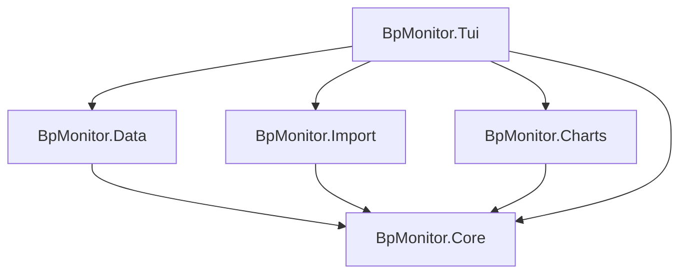

# Architecture: Blood Pressure Monitor

## Solution Structure

```text
code/
├── BpMonitor.slnx
├── BpMonitor.Core           # Domain models, interfaces, business logic
├── BpMonitor.Core.Tests     # Unit tests for Core
├── BpMonitor.Data           # EF Core + SQLite, repository implementations
├── BpMonitor.Data.Tests     # Integration tests for Data
├── BpMonitor.Import         # Markdown parser and import logic
├── BpMonitor.Import.Tests   # Unit tests for Import
├── BpMonitor.Charts         # Plotly.NET chart generation
├── BpMonitor.Charts.Tests   # Snapshot tests for Charts
├── BpMonitor.Tui            # Terminal.Gui v2 app (data entry + list view + import)
├── BpMonitor.Tui.Tests      # Tests for TUI layer
└── BpMonitor.ArchTests      # ArchUnit tests enforcing Clean Architecture rules
```

## Tech Stack

| Concern | Decision |
| --- | --- |
| Solution format | `.slnx` (new XML-based format, VS 2022 17.10+) |
| Language / Runtime | F# on .NET |
| TUI Framework | Terminal.Gui v2 |
| Database | SQLite + EF Core |
| Charting | Plotly.NET — generates interactive HTML, opens in default browser |
| Validation | `FsToolkit.ErrorHandling` — applicative validation with `Validation<'ok, 'err>` |
| Architecture | Clean Architecture (Core has zero dependencies on other projects) |
| Architecture tests | ArchUnit (via `BpMonitor.ArchTests`) |

## Data Model

```fsharp
// BpMonitor.Core
type BloodPressureReadingUnvalidated = {
    Systolic:  int
    Diastolic: int
    HeartRate: int
    Timestamp: DateTimeOffset
    Comments:  string option
}

type BloodPressureReading = {
    Id:         int
    Systolic:   int
    Diastolic:  int
    HeartRate:  int
    Timestamp:  DateTimeOffset
    Comments:   string option
    CreatedAt:  DateTimeOffset
    ModifiedAt: DateTimeOffset
}

type ValidationError =
    | SystolicOutOfRange  of int
    | DiastolicOutOfRange of int
    | HeartRateOutOfRange of int
```

## Dependency Diagram



## Project Responsibilities

### BpMonitor.Core

- Domain models (`BloodPressureReading`, `BloodPressureReadingUnvalidated`)
- Repository interface (`IReadingRepository`)
- Business logic: applicative validation via `FsToolkit.ErrorHandling`
- No dependencies on other projects

### BpMonitor.Data

- EF Core `DbContext` and `ReadingRecord` entity
- SQLite configuration (`appsettings.json`)
- `IReadingRepository` implementations: `EfReadingRepository`, `InMemoryReadingRepository`
- Manual schema migrations via `SchemaMigrations` module (EF Core migrations do not support F#)
- `ReadingRepositoryFactory` wiring

### BpMonitor.Import

- Parses blood pressure readings from Markdown files (`parseMarkdown`, `parseLine`)
- Upsert import logic with summary (`ImportSummary`: added, updated, failed counts)
- Depends on Core only

### BpMonitor.Charts

- Plotly.NET chart generation (`BpChart.toHtml`)
- Produces a self-contained interactive HTML file opened in the default browser
- Depends on Core only

### BpMonitor.Tui

- Terminal.Gui v2 application
- Readings list view with Add (`N`), Edit (`Enter`), Chart (`C`), Import (`I`) keybindings
- Delegates to Core for validation, Data for persistence, Import for file import, Charts for visualisation
- References Core + Data + Import + Charts

### BpMonitor.ArchTests

- ArchUnit rules enforcing Clean Architecture layer boundaries
- Core must not depend on Data, Tui
- Data must not depend on Tui
- Import must not depend on Data, Tui, Charts
- Charts must not depend on Data, Tui

## Design Principles

- Core is dependency-free to allow easy testing and future frontend swaps
- Each project has a single clear responsibility
- Best practices and longevity over shortcuts

## Spike: PWA Phone Client (issue #62 — abandoned)

### Goal

Evaluate a Progressive Web App (Bolero/Blazor WASM) as a phone-friendly frontend for entering and syncing blood pressure readings.

### What worked

- Bolero WASM scaffold running in the browser and installable on Android (Chrome/Firefox)
- Blood pressure entry form with IndexedDB persistence between sessions
- GitHub Pages deployment via CI
- PWA installability (web app manifest, service worker, icons)

### What did not work — sync

All evaluated sync options failed to meet the requirements (private health data, no always-on server, minimal user interaction on Android):

| Option | Outcome |
| --- | --- |
| Nextcloud WebDAV (direct) | CORS blocked — Hetzner StorageShare does not allow custom response headers |
| Nextcloud virtual folder via File System Access API | Android document provider does not support writable file streams |
| `showDirectoryPicker()` to local folder | Works, but Android requires folder re-selection on every browser session — too much friction |
| Web Share API → Nextcloud app | Too many manual steps |
| Self-hosted REST API | Requires always-on server and auth/security work |
| Cloudflare Worker | Rejected — private health data must not leave own infrastructure |
| Syncthing | Same `showDirectoryPicker()` session-permission limitation as above |

### Root cause

Android's security model requires a user gesture to grant file system access on every new browser session. The File System Access API does not persist permissions across sessions on Android Chrome, making seamless background sync impossible in a pure PWA without a reachable server endpoint.

### Conclusion

The PWA approach is abandoned. A phone-friendly frontend requires either a native Android app (which can access the file system without these restrictions) or a lightweight always-on server that the PWA can reach directly.
