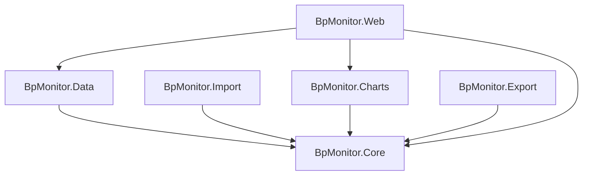

# Architecture: Blood Pressure Monitor

## Solution Structure

```text
code/
├── BpMonitor.slnx
├── BpMonitor.Core           # Domain models, interfaces, business logic
├── BpMonitor.Core.Tests     # Unit tests for Core
├── BpMonitor.Data           # EF Core + SQLite, repository implementations
├── BpMonitor.Data.Tests     # Integration tests for Data
├── BpMonitor.Import         # Markdown and JSON importers
├── BpMonitor.Import.Tests   # Unit tests for Import
├── BpMonitor.Charts         # Plotly.NET chart generation
├── BpMonitor.Charts.Tests   # Snapshot tests for Charts
├── BpMonitor.Export         # JSON serialisation and file write
├── BpMonitor.Export.Tests   # Tests for Export
├── BpMonitor.Web            # Falco web app (dashboard, add, history pages)
├── BpMonitor.Web.Tests      # Tests for Web layer
└── BpMonitor.Arch.Tests     # ArchUnit tests enforcing Clean Architecture rules
```

## Tech Stack

| Concern | Decision |
| --- | --- |
| Solution format | `.slnx` (new XML-based format, VS 2022 17.10+) |
| Language / Runtime | F# on .NET |
| Web Framework | Falco 5 + Falco.Markup (server-rendered F# HTML) |
| Web interactivity | htmx (vendored, no build step) |
| Logging | Serilog.AspNetCore — structured CLEF JSON to stdout; `UseSerilogRequestLogging` for per-request lines; configured via `appsettings.json` `Serilog` section; captured by `docker logs` / `podman logs` / journald |
| Database | SQLite + EF Core |
| Charting | Plotly.NET — generates interactive HTML, opens in default browser |
| Validation | `FsToolkit.ErrorHandling` — applicative validation with `Validation<'ok, 'err>` |
| Architecture | Clean Architecture (Core has zero dependencies on other projects) |
| Architecture tests | ArchUnit (via `BpMonitor.Arch.Tests`) |

## Data Model

```fsharp
// BpMonitor.Core
type FamilyMember = {
    Id:           int
    Name:         string
    IsAdmin:      bool
    IsActive:     bool
    PasswordHash: string option   // None = unclaimed (no password set yet)
    CreatedAt:    DateTimeOffset
    ModifiedAt:   DateTimeOffset
}

type BloodPressureReadingUnvalidated = {
    Systolic:  int
    Diastolic: int
    HeartRate: int
    Timestamp: DateTimeOffset
    Comments:  string option
}

type BloodPressureReading = {
    Id:         int
    MemberId:   int           // which family member this reading belongs to
    Systolic:   int
    Diastolic:  int
    HeartRate:  int
    Timestamp:  DateTimeOffset
    Comments:   string option
    CreatedAt:  DateTimeOffset
    ModifiedAt: DateTimeOffset
}

type ValidationError =
    | SystolicOutOfRange  of int
    | DiastolicOutOfRange of int
    | HeartRateOutOfRange of int
```

## Dependency Diagram



## Project Responsibilities

### BpMonitor.Core

- Domain models (`BloodPressureReading`, `BloodPressureReadingUnvalidated`, `FamilyMember`)
- Repository interfaces (`IReadingRepository`, `IFamilyMemberRepository`)
- `IReadingRepository` is member-scoped: `GetAll memberId`, `Add memberId`, `AddMany memberId`, `Update` (uses `reading.MemberId` as the guard)
- `IFamilyMemberRepository`: `GetAll`, `GetById`, `Add`, `Update`
- `FamilyMember.hasActiveAdmin` enforces the invariant: at least one member must have `IsAdmin = true` and `IsActive = true`; checked before every `Update`
- `FamilyMember.isClaimed m` — true when `PasswordHash` is `Some`
- `PasswordHashing` module — pure PBKDF2-SHA256 hashing via BCL (`Rfc2898DeriveBytes`); `hash password → encoded` (iterations.base64salt.base64hash), `verify password encoded → bool` (constant-time compare)
- Business logic: applicative validation via `FsToolkit.ErrorHandling`
- No dependencies on other projects

### BpMonitor.Data

- EF Core `DbContext` with two `DbSet`s: `Readings` (`ReadingRecord`) and `Members` (`MemberRecord`)
- SQLite with WAL mode + 5 s busy timeout (applied at startup)
- `IReadingRepository` implementations: `EfReadingRepository` (filters by `MemberId`), `InMemoryReadingRepository`
- `IFamilyMemberRepository` implementations: `EfFamilyMemberRepository`, `InMemoryFamilyMemberRepository`
- Manual schema migrations via `SchemaMigrations.apply` (EF Core migrations do not support F#); handles `Members` table creation, default-member seeding, `MemberId` backfill for existing rows, `IsAdmin`/`IsActive` column additions, and `PasswordHash TEXT DEFAULT ''` column addition; `ensureActiveAdmin` promotes the lowest-Id member when no active admin exists (upgrade path for pre-PR#157 DBs)
- `ReadingRepositoryFactory` / `FamilyMemberRepository` factory wiring

### BpMonitor.Import

- Parses blood pressure readings from Markdown files (`parseMarkdown`, `parseLine`)
- Upsert import logic with summary (`ImportSummary`: added, updated, failed counts)
- Imports `BloodPressureReading` lists from JSON (`JsonImport.parse`, `JsonImport.tryReadFromFile`, `JsonImport.import`)
- Depends on Core only

### BpMonitor.Charts

- Plotly.NET chart generation (`BpChart.toHtml`)
- Produces a self-contained interactive HTML file opened in the default browser
- Depends on Core only

### BpMonitor.Export

- JSON serialisation of `BloodPressureReading` lists (`serialize`, `tryWriteToFile`)
- Depends on Core only

### BpMonitor.Web

- Falco web application serving on `0.0.0.0:5000`
- **Authentication:** ASP.NET Core cookie authentication (`AddAuthentication().AddCookie()`); `LoginPath=/login`. Per-member password via PBKDF2-SHA256 (`PasswordHashing` in Core). Members with no password are "unclaimed" and set their password on first login (claim flow). After claiming/verifying, `SignInAsync` issues a cookie carrying `NameIdentifier`, `Name`, and `Role=Admin` claims.
- **Auth model — strict per-member isolation:** every member sees and records only their own readings. No on-behalf-of, no profile switching. Admin members can manage other members via `/members` but still see only their own readings.
- Pages: `/login` member picker + password form (unauthenticated), `/` landing hub, `/add` entry form, `/history` table + chart iframe, `/members` family-member management (admin only), `/members/{id}/edit` member edit, `/members/{id}/reset-password` password reset (admin only), `POST /logout`
- `protect` combinator wraps all app routes; `protectAdmin` wraps `/members*` routes; `/login*` and `/logout` are anonymous
- Active member resolved via `ClaimTypes.NameIdentifier` from the authenticated principal (`authenticatedMember` in Handlers.fs)
- `POST /members` creates a new unclaimed member (no cookie set; member claims on first login). `POST /members/switch` removed.
- `IsAdmin`/`IsActive` stored on each member; invariant (≥1 admin+active) enforced on `updateMember`. Admin flag also determines role claim and `protectAdmin` access.
- Every reading handler resolves the active member first; `IReadingRepository` calls are all member-scoped
- Server-rendered HTML via `Falco.Markup`; htmx for partial updates
- Scoped `DbContext` per request (concurrency-safe)
- Structured logging via Serilog: one CLEF JSON line per request + domain events; logs flow to stdout → container/journal
- References Core + Data + Charts

### BpMonitor.Arch.Tests

- ArchUnit rules enforcing Clean Architecture layer boundaries
- Core must not depend on Data, Web
- Data must not depend on Web
- Import must not depend on Data, Charts, Export, Web
- Charts must not depend on Data, Web
- Export must not depend on Data, Charts, Import, Web

## Design Principles

- Core is dependency-free to allow easy testing and future frontend swaps
- Each project has a single clear responsibility
- Best practices and longevity over shortcuts

## Development Tooling

[mise](https://mise.jdx.dev/) manages all non-dotnet linting tools for this project. The `mise.toml` at the repo root pins all tool versions; run `mise install` once after cloning to set up the local environment.

| Tool | Version source | Purpose |
| --- | --- | --- |
| node | `mise.toml` | Runtime for npm-based tools (markdownlint-cli2) |
| Biome | `mise.toml` | JS linter (`biome check`) for files in `wwwroot/` |
| markdownlint-cli2 | `mise.toml` | Markdown style linter |
| shellcheck | `mise.toml` | Shell script linter |

**Local usage:**

```bash
mise install          # install all pinned tools
mise run lint         # run all non-dotnet linters
mise run lint:md      # markdownlint only
mise run lint:js      # biome only
mise run lint:shell   # shellcheck only
mise exec -- biome check --write  # auto-fix safe JS issues
```

**CI:** the `lint-markdown`, `lint-js`, and `lint-shell` jobs in `.github/workflows/ci.yml` each install tools via `jdx/mise-action` and invoke the corresponding `mise run lint:*` task — the same command as local dev.

## Architecture Decision Records

See [docs/adr/](adr/) for records of significant architectural decisions, including abandoned spikes.
