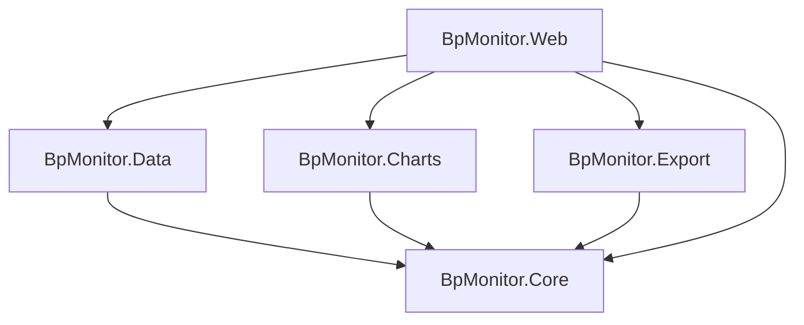

# Architecture: Blood Pressure Monitor

## Solution Structure

```text
code/
├── BpMonitor.slnx
├── BpMonitor.Core           # Domain models, interfaces, business logic
├── BpMonitor.Core.Tests     # Unit tests for Core
├── BpMonitor.Data           # EF Core + SQLite, repository implementations
├── BpMonitor.Data.Tests     # Integration tests for Data
├── BpMonitor.Charts         # Plotly.NET chart generation
├── BpMonitor.Charts.Tests   # Snapshot tests for Charts
├── BpMonitor.Export         # JSON and CSV serialisation and file write
├── BpMonitor.Export.Tests   # Tests for Export
├── BpMonitor.Web            # Falco web app (dashboard, add, history pages)
├── BpMonitor.Web.Tests      # Tests for Web layer
├── BpMonitor.Web.E2E.Tests  # Playwright .NET browser smoke tests (real out-of-process app + Chromium/Firefox)
├── BpMonitor.Arch.Tests     # ArchUnit tests enforcing Clean Architecture rules
└── BpMonitor.TestSupport    # Shared test infrastructure (Verify snapshot settings, domain record builders) for *.Tests projects
```

## Tech Stack

| Concern | Decision |
| --- | --- |
| Solution format | `.slnx` (new XML-based format, VS 2022 17.10+) |
| Language / Runtime | F# on .NET |
| Web Framework | Falco 5 + Falco.Markup (server-rendered F# HTML) |
| Web interactivity | htmx (vendored, no build step) |
| Logging | Serilog.AspNetCore — structured CLEF JSON to stdout; `UseSerilogRequestLogging` for per-request lines; configured via `appsettings.json` `Serilog` section; captured by `docker logs` / `podman logs` / journald |
| Database | SQLite + EF Core |
| Charting | Plotly.NET — generates interactive HTML; plotly.js vendored locally (extracted from Plotly.NET's embedded resource via `scripts/extract-plotly-js.fsx`, no CDN) |
| Validation | `FsToolkit.ErrorHandling` — applicative validation with `Validation<'ok, 'err>` |
| Architecture | Clean Architecture (Core has zero dependencies on other projects) |
| Architecture tests | ArchUnit (via `BpMonitor.Arch.Tests`) |
| E2E tests | Playwright .NET (via `BpMonitor.Web.E2E.Tests`) — drives a real Chromium (default) or Firefox browser against a real out-of-process `BpMonitor.Web` instance with a fresh temp SQLite file |
| Verifying frontend changes | `verify-frontend` skill — adds a throwaway xunit test against `WebAppFixture`, runs it, then deletes it; avoids ad-hoc browser automation |
| Test runner | xUnit v3 on Microsoft.Testing.Platform (MTP) — all 7 test projects run in parallel via `dotnet test` (default `--max-parallel-test-modules` = CPU count) |
| Test coverage | `Microsoft.Testing.Extensions.CodeCoverage` (18.0.6); run with `dotnet test -- --coverage --coverage-output-format cobertura`; outputs one GUID-named `.cobertura.xml` per project into `TestResults/` |

## Data Model

```fsharp
// BpMonitor.Core
type FamilyMember = {
    Id:           int
    Name:         string
    IsAdmin:      bool
    IsActive:     bool
    PasswordHash: string option   // None = unclaimed (no password set yet)
    Goal:         GoalRange       // per-member systolic/diastolic chart goal range
    Language:     Language        // per-member UI language (English | German)
    CreatedAt:    DateTimeOffset
    ModifiedAt:   DateTimeOffset
}

type GoalRange = {
    SystolicMin:  int
    SystolicMax:  int
    DiastolicMin: int
    DiastolicMax: int
}
// GoalRange.defaults = { 90; 140; 60; 90 } — preset from Wegier et al. 2021
// (docs/resources/12911_2021_Article_1598.pdf, Fig. 3)

type BloodPressureReadingUnvalidated = {
    Systolic:  int
    Diastolic: int
    HeartRate: int
    Timestamp: DateTimeOffset
    Comments:  string option
}

type BloodPressureReading = {
    Id:         int
    MemberId:   int           // which family member this reading belongs to
    Systolic:   int
    Diastolic:  int
    HeartRate:  int
    Timestamp:  DateTimeOffset
    Comments:   string option
    CreatedAt:  DateTimeOffset
    ModifiedAt: DateTimeOffset
}

type ValidationError =
    | SystolicOutOfRange  of int
    | DiastolicOutOfRange of int
    | HeartRateOutOfRange of int

type Medication = {
    Id:         int
    MemberId:   int
    Name:       string          // short label shown on the timeline row — "HCTZ"
    FullName:   string option   // long form, hover tooltip — "hydrochlorothiazide"
    Comment:    string option
    StartDate:  DateOnly
    EndDate:    DateOnly option // None = ongoing
    CreatedAt:  DateTimeOffset
    ModifiedAt: DateTimeOffset
}

type MedicationError =
    | NameIsEmpty
    | EndDateBeforeStartDate
```

## Dependency Diagram


```mermaid
graph TD
    Core[BpMonitor.Core]
    Data[BpMonitor.Data]
    Export[BpMonitor.Export]
    Charts[BpMonitor.Charts]
    Web[BpMonitor.Web]

    Data --> Core
    Charts --> Core
    Export --> Core
    Web --> Core
    Web --> Data
    Web --> Charts
    Web --> Export
```

> **Note:** `Export` depends only on `Core` and is wired into `Web` to serve the `/export`
> (JSON) and `/export.csv` endpoints.

## Project Responsibilities

### BpMonitor.Core

- `Language` — `English | German`, `Language.all`/`defaultLanguage`/`nativeName`/`tryParse`/`code` (ISO 639-1)
- `LocalizedStrings` — all user-facing text, one record per language (`LocalizedStrings.en`; `LocalizedStrings.forLanguage`); nested area records (`Shell`, `Table`, `Login`, `Reading`, `Member`, `Medication`, `Trend`, `Errors`, `Charts`) so the compiler enforces every language supplies every field — see ADR 0008 for why this was chosen over `.resx`
- Domain models: `BloodPressureReading`, `BloodPressureReadingUnvalidated`, `FamilyMember` (carries `Language`), `Medication`
- Repository interfaces: `IReadingRepository` (member-scoped), `IFamilyMemberRepository`, `IMedicationRepository` (member-scoped)
- `Medication.parse` — applicative validation (name non-empty, end date on/after start date); `Medication.overlapping from until` — filters to medications whose `[StartDate, EndDate]` interval intersects a date window (ongoing medications, `EndDate = None`, always match forward)
- `FamilyMember.hasActiveAdmin` — invariant: ≥1 member with `IsAdmin = true` and `IsActive = true`
- `FamilyMember.isClaimed` — true when `PasswordHash` is `Some`
- `GoalRange` — per-member systolic/diastolic chart goal range; `GoalRange.defaults` (90–140 / 60–90) and `GoalRange.create` (enforces min < max for each pair)
- `PasswordHashing` — PBKDF2-SHA256 hash/verify
- `ReadingStats` — date-window filter, AHA 2017 BP classification, windowed summary
- `TrendPeriod.Label` is a `PeriodLabel` DU (`ThisWeek`, `CalendarWeek of int`, `MonthOfYear of int * int`, …), rendered via `LocalizedStrings.Trend` at the view layer rather than as English prose in Core
- `DemoData` — deterministic Simpson-family fixture generator (fixed seed, ~5 years of readings)
- Applicative validation via `FsToolkit.ErrorHandling`; no dependencies on other projects

### BpMonitor.Data

- EF Core `DbContext`: `Readings` (`ReadingRecord`), `Members` (`MemberRecord`), `Medications` (`MedicationRecord`)
- SQLite with WAL mode + 5 s busy timeout
- `IReadingRepository`: `EfReadingRepository` (filters by `MemberId`), `InMemoryReadingRepository`
- `IFamilyMemberRepository`: `EfFamilyMemberRepository`, `InMemoryFamilyMemberRepository`
- `IMedicationRepository`: `EfMedicationRepository` (filters by `MemberId`), `InMemoryMedicationRepository`
- `SchemaMigrations.apply` — manual migrations (EF Core migrations don't support F#); `ensureActiveAdmin` promotes lowest-Id member when no active admin exists; creates the `Medications` table on legacy databases
- `DemoSeeder.seedIfEmpty` — seeds Simpson-family data (from `DemoData` in Core) when `BpMonitor:SeedDemoData=true` and the store is empty; idempotent; Ned Flanders additionally gets a demo medication timeline (an ongoing HCTZ + a completed lisinopril course)

### BpMonitor.Charts

- Plotly.NET chart generation — `BpChart.toHtml chartStrings goal readings` (history line chart) and `BpChart.toHtmlDashed chartStrings goal gran aggregated` (trends dashed chart); `toHtml`/`toHtmlDashed`/`toHtmlRecent` take a `ChartStrings` (trace names, axis title) so legend/axis text is localized — `toHtmlMedications` needs none, since medication names are user data, not fixed labels
- `BpChart.toHtmlMedications showScrubber rangeLow rangeHigh medications` — the Medications Timeline (Wegier et al. 2021 Fig. 5): one thick horizontal bar per medication spanning `StartDate`→`EndDate` (ongoing medications reach `rangeHigh`) on a date axis sized to match the BP chart's margins; `showScrubber` adds the same green spike line as `/recent`'s BP chart (`SpikeSnap = Cursor`, not `Data`, so it tracks the cursor rather than snapping to a medication's own start/end date); returns `""` for an empty medication list so callers skip rendering the panel
- Each medication bar gets its own color: `medicationSlot`/`assignSlots` hash the medication's name (FNV-1a, stable across restarts) into an 8-slot categorical palette, linear-probing past collisions — same medication, same color across `/recent`/`/history`. Each trace carries both its light and dark hex as `meta = "light|dark"`; `wwwroot/theme.js`'s `restyleMedicationColors` swaps the visible half on theme toggle instead of duplicating the palette in JS
- Returns a chart HTML fragment embedded directly into the page by the calling handler (`ReadingHandlers.fs`)
- `goal: GoalRange` renders a translucent horizontal background band per series (systolic mint `#008471`, diastolic cocoa `#9C652B`) behind the data, matching each series' line color — the "like-with-like" goal-range design from Wegier et al. 2021 (`docs/resources/12911_2021_Article_1598.pdf`, Fig. 3)
- Depends on Core only

### BpMonitor.Export

- JSON serialisation of `BloodPressureReading` lists (`JsonExport.serialize`, `JsonExport.tryWriteToFile`)
- CSV serialisation of `BloodPressureReading` lists (`CsvExport.serialize`, `CsvExport.tryWriteToFile`)
- Referenced by `BpMonitor.Web` to serve the `/export` (JSON) and `/export.csv` endpoints
- Depends on Core only

### BpMonitor.Web

- Falco web application on `0.0.0.0:5000`; references Core + Data + Charts + Export
- **Auth:** ASP.NET Core cookie auth; per-member PBKDF2-SHA256 password; unclaimed members set password on first login; cookie carries `NameIdentifier`/`Name`/`Role` claims
- **Cookie policy:** `SameSite=Lax` (not `Strict`) so the cookie still rides along on a top-level navigation from outside the site (e.g. tapping a link in another app) — safe because there's no antiforgery token to leak via cross-site GET, and `Lax` still withholds the cookie on cross-site POSTs. A "Remember me" checkbox on login sets `IsPersistent` on the auth ticket; duration is `BpMonitor:RememberMeDays` (default 30, clamped to 1–400 — 400 is the hard cap Firefox/Chrome place on cookie lifetime), sliding on each request. Unchecked, sign-in produces an ordinary session cookie. Data Protection keys (which encrypt/validate the cookie) are persisted outside the container via `BpMonitor:DataProtectionKeyPath` — unset, they live in the container's ephemeral home dir and a "remember me" cookie stops validating on every redeploy
- **Isolation:** each member sees only their own readings; admins manage members via `/members` but not their readings
- **Routes:** `/` hub, `/add`, `/history`, `/recent`, `/recent/full`, `/trends`, `/settings`, `/settings/language`, `/medications`, `/medications/{id}/edit`, `/medications/{id}`, `/medications/{id}/delete`, `/members`, `/members/{id}/edit`, `/members/{id}/reset-password`, `/login`, `/login/{id}`, `POST /logout`, `GET /health` (anonymous)
- **Language:** `LocalizedStrings` (Core) is resolved per request via `HandlerHelpers.strings`/`AuthHandlers.authenticatedStrings` in this order — the authenticated member's `Language` → a `bpmonitor_lang` cookie (covers `/login`, which has no member yet) → `Accept-Language` → `BpMonitor:DefaultLanguage` config key → `English`. No `RequestLocalizationMiddleware` — resolution is an explicit function call, matching the rest of the app. `LocalizedStrings` is passed as the first parameter to every view/handler that needs it (see ADR 0008). `/settings` has a language picker (`MemberViews.languageSection`, `POST /settings/language`) that persists the choice on `FamilyMember.Language` and refreshes the cookie
- **`/health`:** anonymous liveness + SQLite-reachability probe (`HealthHandlers.fs`); `200` with `{status, version, database}` JSON when `DbContext.Database.CanConnect()` succeeds, `503` otherwise; polled by the Containerfile `HEALTHCHECK` and the example Podman/Compose deploys, and by `BpMonitor.Web.E2E.Tests`' readiness wait — successful polls are logged at `Verbose` (dropped) to avoid flooding stdout
- **`/settings`:** two self-service sections under one page shell (`SettingsViews.settings`), each a collapsible `<details data-persist-key>` (open by default, state remembered via `wwwroot/details-memory.js`): a Goal Range form (`MemberViews.goalRangeSection`) where the logged-in member edits their own chart goal range (`GoalRange`, validated via `GoalRange.create`, min < max per pair), and a Medications section (`MedicationViews.medicationsSection`) — a table of the member's medications (required/optional fields labeled on the add/edit forms) plus an add form, backed by `/medications*` CRUD routes (`MedicationHandlers.fs`). Delete is styled destructive (`.button-danger` in `app.css`, specificity-matched to override pico.min.css's own `.outline` rule) and gated by `ViewLayout.inlineDangerPostButton`'s `hx-confirm` — note `hx-confirm` must sit on the `<form>`, not an inner button, since htmx's boost resolves a submit's triggering element to the form and only walks up from there
- **Medications Timeline:** a collapsible panel (`MedicationViews.timelinePanel`, `<details data-persist-key>`) rendered below the BP chart on `/recent` and `/history` — Wegier et al. 2021 Fig. 5's medication timeline. Collapsed by default; open/closed state is remembered per-panel across page loads via `wwwroot/details-memory.js` (`localStorage`). Not shown on `/trends`, whose x-axis is categorical period labels rather than dates. `wwwroot/medications-sync.js` keeps the timeline's x-axis in sync with the BP chart above it (pan/zoom, including the Last 7/30 days buttons) and mirrors the scrubber spike between the two charts in both directions, reusing `recent-scrubber.js`'s `d2l`/`l2p` pixel-geometry technique; `wwwroot/plot-ready.js`'s `whenPlotReady` takes an `index` parameter (0 = BP chart, 1 = timeline) since the page now has two Plotly divs
- **`/recent`:** raw readings loaded for the last 365 days (`recentLoadWindowDays`), chart and value strip focused on the last 30 days (`recentChartWindowDays`) — panning the chart left reveals the rest of the loaded window. Above the chart, a Fig. 5-style (Wegier et al. 2021) "value strip" table lists every Systolic/Diastolic value in the loaded window in chronological order, sized to match the chart's rendered width with no horizontal scrolling; cells outside the 30-day focus start hidden and un-hide as the chart pans. Each value is color-coded against the member's `GoalRange` (`GoalRange.classifySystolic`/`classifyDiastolic`): above the goal max renders orange, below the goal min renders blue, in-range stays neutral. When readings older than the 365-day load window exist, a "Load full history" button htmx-swaps the chart container (`GET /recent/full`, `ReadingHandlers.recentFull`) for one rendered from the member's entire history, lifting the cap for that page view
- **`/trends`:** granularity selector (Weekly/Monthly/Yearly) + htmx-swapped period fragments; stats from `ReadingStats` (Core); `TimeProvider` injected for testability
- `protect` / `protectAdmin` combinators; active member resolved from `ClaimsPrincipal`
- Server-rendered HTML via `Falco.Markup`; htmx for partial updates; scoped `DbContext` per request
- Structured logging via Serilog (stdout → container/journal)
- **Version footer:** `Version.current` reads `AssemblyInformationalVersion`; shows `dev` when the value contains a `+` suffix (SDK default), `v1.2.3` for stamped releases

### BpMonitor.Arch.Tests

- ArchUnit rules enforcing Clean Architecture layer boundaries: Core ↛ Data/Web; Data ↛ Web; Charts ↛ Data/Web; Export ↛ Data/Charts/Web

## Design Principles

- Core is dependency-free to allow easy testing and future frontend swaps — this is why `LocalizedStrings`/`Language` (needed by both Web and Charts) live in Core as plain data rather than behind a localization package (see ADR 0008)
- Each project has a single clear responsibility
- Best practices and longevity over shortcuts

## Development Tooling

[mise](https://mise.jdx.dev/) manages all non-dotnet linting tools for this project. The `mise.toml` at the repo root pins all tool versions; run `mise install` once after cloning to set up the local environment.

| Tool | Version source | Purpose |
| --- | --- | --- |
| node | `mise.toml` | Runtime for npm-based tools (markdownlint-cli2) |
| Biome | `mise.toml` | JS linter (`biome check`) for files in `wwwroot/` |
| TypeScript | `mise.toml` (npm backend) | Type-checks the hand-written `wwwroot/` JS via JSDoc (`tsc --checkJs`, config in `tsconfig.json` + `typings/globals.d.ts`) — no build step, the JS ships as-is |
| markdownlint-cli2 | `mise.toml` | Markdown style linter |
| shellcheck | `mise.toml` | Shell script linter |

**Local usage:**

```bash
mise install          # install all pinned tools
mise run lint         # run all non-dotnet linters
mise run lint:md      # markdownlint only
mise run lint:js      # biome only
mise run lint:ts      # tsc checkJs only
mise run lint:shell   # shellcheck only
mise exec -- biome check --write  # auto-fix safe JS issues
```

**CI:** the `lint-markdown`, `lint-js` (Biome + `tsc` checkJs), and `lint-shell` jobs in `.github/workflows/ci.yml` each install tools via `jdx/mise-action` and invoke the corresponding `mise run lint:*` task — the same command as local dev.

**Release notes:** `.github/workflows/release.yml` builds the GitHub release body from the pushed tag's annotation followed by categorized notes from `scripts/release-notes.sh <tag>`, which groups commits since the previous tag by conventional-commit type into the same Added/Changed/Fixed/Security/Maintenance headings as `CHANGELOG.md`, collapsing routine dependency bumps into a `<details>` block.

## Architecture Decision Records

See [docs/adr/](adr/) for records of significant architectural decisions, including abandoned spikes.
